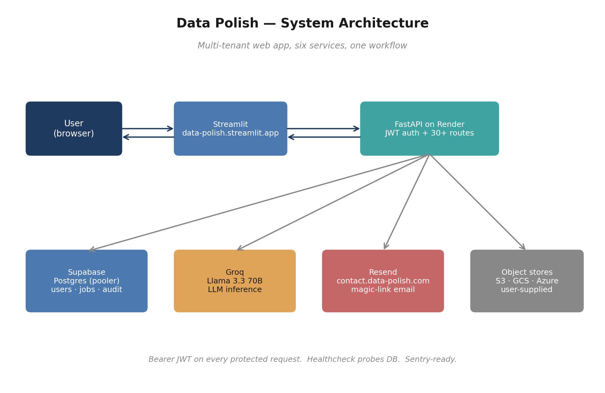
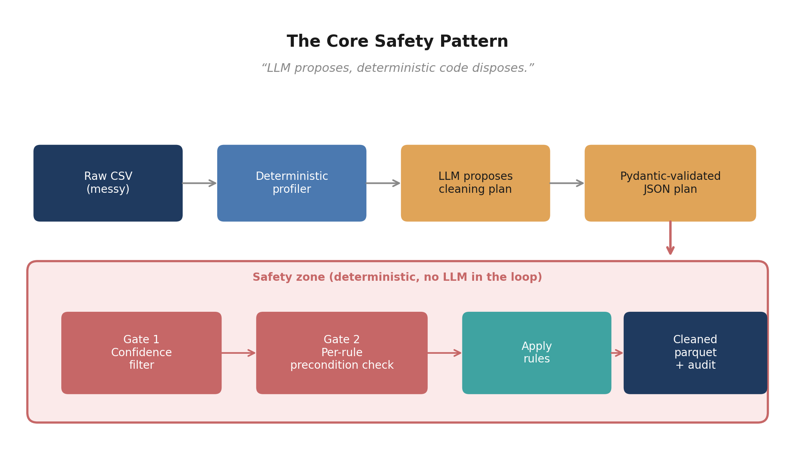
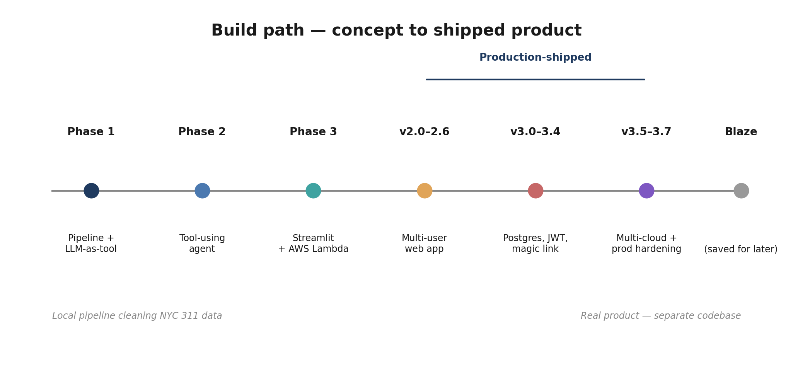

# Data Polish

> A multi-user web app that cleans messy real-world datasets. Upload a CSV
> (or pull from S3 / GCS / Azure), an LLM proposes cleaning rules grounded in
> a deterministic per-column profile, two layers of safety gates re-validate
> every rule before applying, and you get back a cleaned parquet plus a full
> audit log of every change.

**Live demo:** <https://data-polish.streamlit.app>  ·  **API:** <https://datapolish-api.onrender.com/healthz>

Built end-to-end as a portfolio project: frontend, backend, database,
deployment, custom domain, transactional email — all of it shipped to
production on a free-tier stack.

---

## Architecture



Six services, one workflow. Bearer JWT on every protected request; healthcheck
probes the DB so Render can react when Supabase pauses on the free tier.

| Service             | Role                                              |
| ------------------- | ------------------------------------------------- |
| Streamlit Cloud     | Frontend at `data-polish.streamlit.app`           |
| Render (FastAPI)    | Backend, ~30 routes, JWT auth                     |
| Supabase Postgres   | Users, jobs, audit events, magic-link tokens      |
| Groq                | Llama 3.3 70B for LLM inference                   |
| Resend              | Magic-link email from `contact.data-polish.com`   |
| Cloud object stores | S3, GCS, Azure — user-supplied creds, never stored |

---

## The core idea



> **LLM proposes, deterministic code disposes.**

Every LLM output crosses one explicit boundary into a deterministic safety zone
before it can mutate real data. Three pillars set this apart from "stuff data
into ChatGPT" demos:

1. **Profile-first prompting.** The LLM never sees raw rows. It sees a small,
   structured profile (column dtypes, null %, casing patterns, top values) —
   about 5 KB of signal in place of 50 MB of noise. Faster, cheaper, sharper.
2. **Structured outputs as a contract.** The LLM's reply is parsed into a
   typed `CleaningPlan` (Pydantic). If the model hallucinates an operation we
   don't recognize, validation fails loud — we never apply rules we don't
   understand.
3. **Two-stage safety gates.** Every proposed rule passes through a confidence
   filter (only `high`-confidence rules auto-apply) *and* a per-rule
   precondition check (re-reads the column profile, confirms the rule still
   makes sense). Catches LLM false positives the prompt failed to prevent.

The first time the gates caught an LLM mistake felt like vindication: the
model proposed a high-confidence cleaning rule on `intersection_street_1`,
except in the actual data that column was 99% null. The per-rule gate re-read
the profile, saw the precondition failed, rejected the rule, and recorded the
rejection in the audit log. No corrupted data, full provenance.

---

## Build path



| Stage         | What shipped                                                      |
| ------------- | ----------------------------------------------------------------- |
| **Phase 1**   | Local pipeline: profile → LLM proposes → safety gates → apply     |
| **Phase 2**   | Tool-using agent on top of the same engine                        |
| **Phase 3**   | Streamlit dashboard + containerized AWS Lambda (S3-triggered)     |
| **v2.0–v2.6** | Multi-user web app: FastAPI, per-user state, S3 connector, quality score, deployed live |
| **v3.0–v3.4** | Postgres on Supabase, JWT auth, magic-link email, audit log, large-dataset streaming |
| **v3.5–v3.7** | GCS + Azure connectors, structured logging, DB-aware healthcheck, Sentry-ready, ops runbook |

Full version-by-version notes in [`PROJECT_NOTES.md`](PROJECT_NOTES.md).

---

## Try it locally

Requires Python 3.11+ and a free [Groq API key](https://console.groq.com).

```bash
# 1. Clone and install
git clone https://github.com/nvpainter5/data-polish.git
cd data-polish
python3 -m venv .venv
source .venv/bin/activate
pip install -r requirements.txt

# 2. Configure
cp .env.example .env
# Edit .env — at minimum set GROQ_API_KEY. Leave DATABASE_URL blank
# to fall back to local SQLite at data/datapolish.db.

# 3. Run the API
uvicorn api.main:app --reload --port 8000

# 4. Run the UI (in another terminal)
streamlit run ui/Home.py
```

The UI opens at `http://localhost:8501` and talks to the API on `:8000`.
First-time users register, then can either set a password or sign in with a
magic-link code (printed to the API console when `DEV_MODE=true`).

---

## End-to-end pipeline run (no web app)

Useful for understanding the core engine in isolation. Four commands, in order:

```bash
# 1. Confirm the LLM connection works
python scripts/smoke_test_groq.py

# 2. Download a reproducible NYC 311 sample (~50k rows)
python scripts/download_311_sample.py

# 3. Profile the dataset (deterministic, no AI)
python scripts/profile_dataset.py

# 4. Ask the LLM to propose cleaning rules from the profile
python scripts/propose_cleaning.py

# 5. Apply the plan with safety gates; write parquet + audit
python scripts/apply_cleaning.py
```

Each step writes JSON into `reports/` or parquet into `data/cleaned/` and
prints a human-readable summary.

### Sample audit output (truncated)

```
AUDIT: 10 applied / 8 skipped / 0 failed

APPLIED:
  [set_case]                   complaint_type           -> 10,884 rows changed
  [set_case]                   descriptor               -> 14,657 rows changed
  [collapse_internal_whitespace] incident_address        -> 3,113 rows changed
  [collapse_internal_whitespace] resolution_description  -> 10,198 rows changed
  ...

SKIPPED:
  [collapse_internal_whitespace] intersection_street_1   (high)
      reason: no double-spaces detected in profile      ← gate save
  [set_case]                   borough                   (medium)
      reason: confidence=medium; only `high` rules auto-apply
  ...

Wrote cleaned dataset: data/cleaned/nyc_311_cleaned.parquet  (5.0 MB)
Wrote audit:           reports/cleaning_audit_<timestamp>.json
```

---

## Project layout

```
data-polish/
├── api/                        # FastAPI backend (v2/v3)
│   ├── main.py                 # ~30 routes: auth, jobs, pipeline, audit
│   ├── auth.py                 # bcrypt + JWT (python-jose)
│   ├── magic_link.py           # email OTP via Resend
│   ├── audit.py                # security event logging
│   ├── cloud_storage.py        # S3 / GCS / Azure download helpers
│   ├── db.py                   # SQLAlchemy engine (Postgres / SQLite)
│   ├── models.py               # User, Job, AuditEvent, MagicLinkToken
│   ├── jobs.py                 # job state CRUD
│   ├── pipeline_runner.py      # streaming + chunked read for large files
│   ├── storage.py              # local filesystem artifact storage
│   ├── user_store.py           # register / authenticate
│   └── __init__.py             # logging + Sentry init
├── ui/                         # Streamlit frontend
│   ├── Home.py                 # landing + auth
│   ├── api_client.py           # httpx wrapper around the API
│   ├── auth_helpers.py         # session-state helpers
│   └── pages/                  # Upload, Run, Results, Activity
├── src/datapolish/             # Pure pipeline library (used by api/ and lambda/)
│   ├── llm_client.py           # provider-agnostic LLM wrapper (Groq today)
│   ├── profile.py              # deterministic profiler
│   ├── cleaning.py             # LLM-driven rule proposer
│   ├── apply.py                # apply with confidence + safety gates
│   └── agent.py                # tool-using agent (Phase 2)
├── scripts/                    # runnable CLIs that wire library modules
├── tests/                      # 36+ unit tests, < 1s total
├── lambda/                     # AWS Lambda + Dockerfile (Phase 3b)
├── docs/                       # operations runbook, resend setup, blueprints
├── render.yaml                 # Render Blueprint for backend deploy
├── template.yaml               # AWS SAM template for Lambda
└── app.py                      # legacy Streamlit dashboard (Phase 3a reference)
```

---

## Tests

```bash
pytest -v
```

36+ unit tests, all run in under a second. No network or LLM calls in the
suite (the API tests use a temp SQLite DB and mocked Groq).

Coverage:
- Deterministic profiler (numeric, string, datetime stats)
- Cleaning schema validation (rejects unknown operations, bad confidence)
- Slim payload construction (token-efficient prompts)
- Apply step (confidence + per-operation safety gates)
- Post-apply validation (row count, key uniqueness)
- Agent tools (overview hints, profile, apply via gates)
- API contract (auth flows, JWT, per-user job isolation, cloud sources)

---

## Stack

| Layer            | Choice                                      |
| ---------------- | ------------------------------------------- |
| LLM              | Groq + Llama 3.3 70B (provider-abstracted)  |
| Backend          | FastAPI + Uvicorn                           |
| Frontend         | Streamlit (multi-page)                      |
| Database         | Postgres via Supabase (SQLite for local dev) |
| ORM              | SQLAlchemy 2.0                              |
| Auth             | bcrypt + python-jose JWT, magic-link OTP    |
| Email            | Resend                                      |
| Data engine      | pandas + pyarrow                            |
| Validation       | Pydantic v2                                 |
| Deployment       | Render (API) + Streamlit Cloud (UI)         |
| Object stores    | boto3, google-cloud-storage, azure-storage-blob |
| Observability    | Python `logging` + Sentry (opt-in)          |

---

## Operations

See [`docs/operations.md`](docs/operations.md) for the on-call runbook
(healthcheck reading, common incidents, deploy reference, secret-rotation
table).

`/healthz` returns JSON like:

```json
{
  "ok": true,
  "service": "datapolish-api",
  "version": "3.7.0",
  "env": "production",
  "checks": {
    "database": "ok",
    "sentry": "enabled",
    "email_provider": "resend"
  }
}
```

503 if the DB is unreachable, so orchestrators do the right thing.

---

## Roadmap

- [x] **Phase 1** — Deterministic profiler + LLM-as-tool cleaning + safety-gated apply
- [x] **Phase 2** — Tool-using autonomous agent
- [x] **Phase 3a** — Streamlit demo + write-up
- [x] **Phase 3b** — AWS Lambda + S3 deployment
- [x] **v2.0–v2.6** — FastAPI multi-user web app deployed on Render + Streamlit Cloud
- [x] **v3.0–v3.4** — Postgres, JWT, magic-link email auth, audit log, large-dataset support
- [x] **v3.5–v3.7** — GCS + Azure connectors, structured logging, DB-aware healthcheck, ops runbook
- [ ] Ollama as an offline LLM provider (deferred)

---

## Source data

NYC 311 Service Requests via [NYC Open Data](https://data.cityofnewyork.us/Social-Services/311-Service-Requests-from-2010-to-Present/erm2-nwe9).
The sample is pulled fresh by `scripts/download_311_sample.py` against the
public Socrata API; date range and row count pinned for reproducibility.
